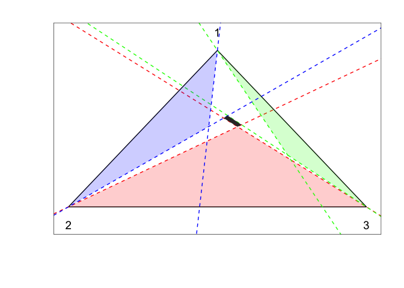

## dempsterpolytope

Implements a Gibbs sampler for Dempster’s inference approach for
Categorical distributions; this package is a companion to an article by
Pierre E. Jacob, Ruobin Gong, Paul T. Edlefsen, Arthur P. Dempster,
available at <https://www.researchers.one/article/2019-10-14>.

This is not a general-purpose statistical software. This is just a
collection of scripts intended to reproduce figures and tables of a
paper. Use at your own risk\!

The folder inst/reproduce/ contains the scripts to reproduce the
figures. The folder inst/tests/ contains internal checks, and vignettes/
contains tutorials on how to use the package’s main functions, which at
the moment are just R scripts and not proper “R vignettes”.

### Installation

The package can be installed from R via:

``` r
# install.packages("devtools")
devtools::install_github("pierrejacob/dempsterpolytope")
```

It depends on the packages Rcpp, RcppEigen, igraph, rcdd, dplyr,
lpSolveAPI which can be installed
via:

``` r
install.packages(c("Rcpp", "RcppEigen", "igraph", "rcdd", "dplyr", "lpSolveAPI"))
```

Additionally you might want to install other packages, to help with
parallel computation:

``` r
install.packages(c("doParallel", "doRNG"))
```

and to help with manipulating results and plotting:

``` r
install.packages(c("tidyr", "ggplot2"))
```

although these packages are not strictly required.

### Usage

The “Dempster-Shafer” approach to inference leads, in the case of
Categorical distributions, to random convex polytopes. The Gibbs sampler
implemented in this package generates such polytopes. The following code
shows a random polytope obtained after some iterations of the Gibbs
sampler, for the data set (10, 4, 7), meaning 10 observations in
category 1, 4 in category 2, 7 in category 3.

``` r
library(dempsterpolytope)
set.seed(1)
# count data
counts <- c(10, 4, 7)
# number of MCMC iterations
niterations <- 100
# run Gibbs sampler
gibbs_results <- gibbs_sampler(niterations, counts)
# obtain a K x K matrix representing a convex polytope in the simplex
# by taking the terminal iteration of the Gibbs chain
eta <- gibbs_results$etas[niterations,,]
# convert polytope to H-representation and V-representation
eta_converted <- etas2cvxpolytope(eta)
# H-representation, or "half-plane" representation
# means the set is represented as points x such that 'constr' times x <= 'rhs' 
eta_converted$constr
#> $constr
#>            [,1]      [,2]
#>  [1,]  1.000000  1.000000
#>  [2,] -1.000000  0.000000
#>  [3,]  0.000000 -1.000000
#>  [4,] -0.344655  1.000000
#>  [5,] -1.608173 -1.000000
#>  [6,]  1.000000 -3.351633
#>  [7,] -1.000000 -6.775739
#>  [8,]  3.394207  2.394207
#>  [9,]  1.271098  2.271098
#> 
#> $rhs
#> [1]  1.000000  0.000000  0.000000  0.000000 -1.000000  0.000000 -1.000000
#> [8]  2.394207  1.271098
#> 
#> $dir
#> [1] "<=" "<=" "<=" "<=" "<=" "<=" "<=" "<=" "<="
# V-representation, or "vertex" representation
# means the set is represented by its vertices
eta_converted$vertices_barcoord
#>           [,1]      [,2]      [,3]
#> [1,] 0.5120778 0.1764902 0.3114321
#> [2,] 0.5245116 0.1564944 0.3189940
#> [3,] 0.5827381 0.1738669 0.2433950
#> [4,] 0.5674307 0.1955678 0.2370015
# next we can view the K-simplex as a triangle, with K = 3 here
# and the feasible polytope can be shown as a polygon within the simplex
gs <- set_custom_theme()
g <- create_plot_triangle(gs)
g <- add_plot_polytope(gs, g, eta_converted)
g
```

<!-- -->

The generated polytope is the black polygon in the middle of the
simplex.
