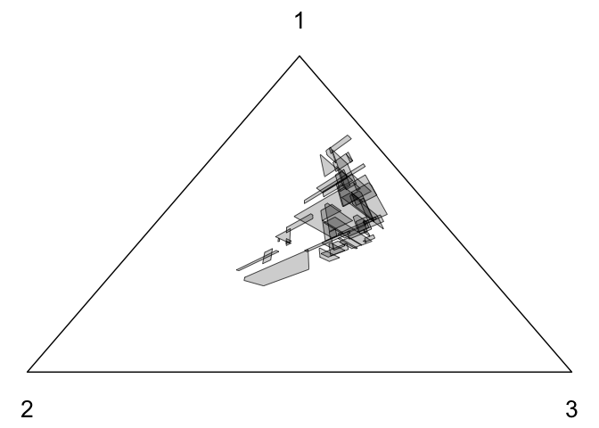

## dempsterpolytope

This package implements a Gibbs sampler for Dempster’s inference
approach for Categorical distributions using the “simplicial model” or
“structure of the second kind”. This package is a companion to an
article entitled *A Gibbs sampler for a class of random convex
polytopes* by Pierre E. Jacob, Ruobin Gong, Paul T. Edlefsen, Arthur P.
Dempster, available at <https://arxiv.org/abs/1910.11953v3>, and due to
appear with a discussion in the Journal of the American Statistical
Association, Theory & Methods, in 2021 (see
<https://www.tandfonline.com/doi/abs/10.1080/01621459.2021.1881523?journalCode=uasa20>).

The sampling problem addressed by this package dates back to these
articles:

-   Dempster, A.P., 1966. New methods for reasoning towards posterior
    distributions based on sample data. The Annals of Mathematical
    Statistics, 37(2), pp.355-374.

-   Dempster, A.P., 1972. A class of random convex polytopes. The Annals
    of Mathematical Statistics, pp.260-272.

**Important**: this is not a general-purpose statistical software. This
is just a collection of scripts intended to reproduce figures and tables
of a paper. Use at your own risk!

The folder inst/reproduce/ contains the scripts to reproduce the figures
of the article. The folder inst/tests/ contains internal checks, and
vignettes/ contains tutorials on how to use the package’s main
functions, which at the moment are just R scripts and not proper “R
vignettes”.

### Installation

The package can be installed from R via:

``` r
# install.packages("devtools")
devtools::install_github("pierrejacob/dempsterpolytope")
```

It depends on the packages Rcpp, RcppEigen, igraph, rcdd, dplyr,
lpSolveAPI which can be installed via:

``` r
install.packages(c("Rcpp", "RcppEigen", "igraph", "rcdd", "dplyr", "lpSolveAPI"))
```

Additionally you might want to install other packages, to help with
parallel computation:

``` r
install.packages(c("doParallel", "doRNG"))
```

and to help with manipulating results and plotting:

``` r
install.packages(c("tidyr", "ggplot2"))
```

although these packages are not strictly required.

### Usage

The “Dempster-Shafer” approach to inference leads, in the case of
Categorical distributions, to random convex polytopes. The Gibbs sampler
implemented in this package generates such polytopes. The following code
shows a random polytope obtained after some iterations of the Gibbs
sampler, for the data set (10, 4, 7), meaning 10 observations in
category 1, 4 in category 2, 7 in category 3.

``` r
library(dempsterpolytope)
set.seed(1)
# count data
counts <- c(10, 4, 7)
# number of MCMC iterations
niterations <- 100
# run Gibbs sampler
gibbs_results <- gibbs_sampler(niterations, counts)
# obtain a K x K matrix representing a convex polytope in the simplex by taking
# the terminal iteration of the Gibbs chain
eta <- gibbs_results$etas[niterations, , ]
# There are multiple ways of representing a polytope.  The H-representation, or
# 'half-plane' representation, means the set is represented as points x such
# that 'constr' times x <= 'rhs'
Hrep <- eta_linearconstraints(eta)
print(Hrep$constr)
#>            [,1]      [,2]       [,3]
#> [1,] -0.4637037  1.000000  0.0000000
#> [2,] -1.0297893  0.000000  1.0000000
#> [3,]  1.0000000 -2.586375  0.0000000
#> [4,]  0.0000000 -6.083083  1.0000000
#> [5,]  1.0000000  0.000000 -1.5324235
#> [6,]  0.0000000  1.000000 -0.8408546
print(Hrep$dir)
#> [1] "<=" "<=" "<=" "<=" "<=" "<="
print(Hrep$rhs)
#> [1] 0 0 0 0 0 0
# In small dimensions we can also obtain the list of vertices corresponding to
# this polytope, and then the polytope itself is the convex hull of these
# vertices
eta_vertices <- etas_vertices(eta)
print(eta_vertices)
#>           [,1]      [,2]      [,3]
#> [1,] 0.4010438 0.1859655 0.4129907
#> [2,] 0.4138335 0.1600052 0.4261613
#> [3,] 0.4725307 0.2191142 0.3083551
#> [4,] 0.4903878 0.1896043 0.3200080
# next we can view the K-simplex as a triangle, with K = 3 here and the
# feasible polytopes as polygons within the triangle
gs <- set_custom_theme()
g <- create_plot_triangle(gs)
cvxpolytope_cartesian.df <- data.frame()
for (iter in 51:100) {
    vertices <- etas_vertices(gibbs_results$etas[iter, , ])
    cvx_cartesian <- t(apply(vertices, 1, function(row) barycentric2cartesian(row,
        gs$v_cartesian)))
    average_ <- colMeans(cvx_cartesian)
    o_ <- order(apply(sweep(cvx_cartesian, 2, average_, "-"), 1, function(v) atan2(v[2],
        v[1])))
    cvx_cartesian <- cvx_cartesian[o_, ]
    cvxpolytope_cartesian.df <- rbind(cvxpolytope_cartesian.df, data.frame(cvx_cartesian,
        iter = iter))
}
gpolytopes <- g + geom_polygon(data = cvxpolytope_cartesian.df, aes(x = X1, y = X2,
    group = iter), size = 0.25, alpha = 0.2, fill = "black", colour = "black")
gpolytopes
```

<!-- -->

The generated polytopes are black polygons overlaid in the simplex.
